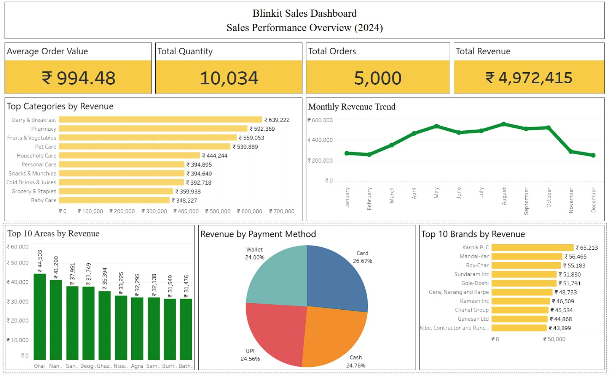

# Blinkit Sales Dashboard

Interactive sales analytics dashboard built using **SQL** and **Tableau Public** to analyze Blinkit's sales performance and generate business insights.

---

# Project Overview

This project analyzes Blinkit's sales data using **SQL** for data analysis and **Tableau Public** for interactive visualization. The dashboard helps understand sales performance, product trends, customer purchasing behavior, payment methods, and regional sales distribution to support data-driven business decisions.

---

# Tools & Technologies

- SQL (MySQL)
- Tableau Public

---

# SQL Analysis

SQL was used to:

- Data Cleaning
- KPI Calculations
- Revenue Analysis
- Category-wise Revenue Analysis
- Brand-wise Revenue Analysis
- Monthly Revenue Trend
- Payment Method Analysis
- Top Areas by Revenue

---

# Dashboard Features

- Total Revenue
- Total Orders
- Total Quantity Sold
- Average Order Value
- Monthly Revenue Trend
- Top Categories by Revenue
- Top Brands by Revenue
- Top Areas by Revenue
- Revenue by Payment Method

---

# Key Insights

- Total Revenue generated: **₹4,972,415** from **5,000 customer orders**.
- A total of **10,034 products** were sold with an **Average Order Value (AOV) of ₹994.48**.
- **Dairy & Breakfast** is the highest revenue-generating category, followed by **Pharmacy** and **Fruits & Vegetables**.
- Revenue increased steadily from **March to August**, indicating strong seasonal demand.
- **Card payments** contributed the highest share of revenue (26.67%), while Cash, UPI, and Wallet payments remained fairly balanced.
- The Top 10 Brands generated a significant share of total revenue, helping identify high-performing products.
- Revenue is distributed across multiple cities, with the Top 10 Areas contributing the highest sales.
- The dashboard provides actionable insights for monitoring KPIs, identifying top-performing products, understanding customer payment preferences, and tracking     monthly business performance.

---

# Dashboard Preview

---

# Live Tableau Dashboard

🔗 **View Interactive Dashboard**

🔗 **[View Interactive Dashboard](https://public.tableau.com/views/blinkitsalesdashboard/Dashboard1?:language=en-US&publish=yes&:sid=&:redirect=auth&:display_count=n&:origin=viz_share_link)**

---

# Repository Contents

- blinkit_sales_analysis.sql
- blinkit sales dashboard.twbx
- dashboard.jpeg
- README.md

---

# Author

**Chintan Upadhyay**

- LinkedIn: [Chintan Upadhyay](https://www.linkedin.com/in/chintan-upadhyay-1461a1258)

- Tableau Public: [My Tableau Public Profile](https://public.tableau.com/app/profile/chintan.upadhyay/vizzes)

---

⭐ If you found this project useful, consider giving this repository a star.
